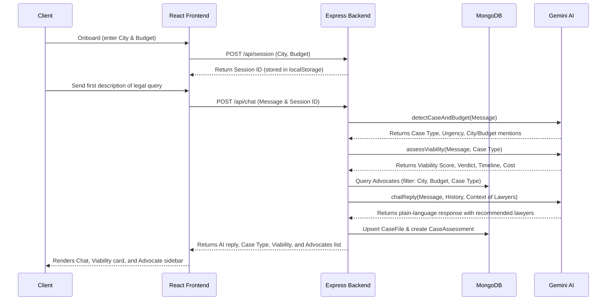

# Project Context: LegalLink / LegalBlindSpot

Welcome to the **LegalLink (LegalBlindSpot)** project. This document serves as a comprehensive system map and operational guide. It details the project architecture, directory structure, data flow, API endpoints, database schemas, and the AI features that drive the platform.

---

## ⚙️ Project Overview

**LegalLink** is a digital legal assistant tailored for first-time users in India. The platform bridges the gap between citizens and legal help by:
- **Demystifying Legal jargon:** Translating complex laws into plain English.
- **Assessing Case Viability:** Using AI to predict whether a case is worth fighting, estimating costs, and outlining timelines.
- **Assisting Intake workflows:** Gathering structured information using conversational flows.
- **Checking Legal Advice:** Reviewing claims or advice received by clients to detect errors or misleading guidance.
- **Validating Lawyer Trustworthiness:** Running an algorithmic **Trust Score System** to rate advocates.
- **Connecting Clients & Lawyers:** Matching clients with advocates within their budget and city, and allowing clients to send case requests that lawyers can accept/decline.

The project features a **React-based Web Frontend** and a **Node.js/Express Backend** with MongoDB, along with an **interactive Terminal Chatbot mode**.

---

## 📁 Repository Directory Structure

Below is an overview of the key directories and files in the repository:

```text
LegalBlindSpot/
├── package-lock.json
├── README.md               # Main run and setup guide
├── project-context.md      # [This File] Main developer/AI context guide
│
├── backend/
│   ├── package.json        # Node.js configurations & dependencies
│   ├── server.js           # Main Express server (REST APIs, routing, SMTP configs)
│   ├── chat.js             # Terminal chatbot entry point (runs interactive console)
│   ├── seed.js             # Seed entrypoint executing data/seedAdvocates.js
│   │
│   ├── db/
│   │   └── connection.js   # Mongoose connection wrapper
│   │
│   ├── models/             # Mongoose/MongoDB Database Schemas
│   │   ├── User.js         # User account (clients, lawyers, authentication)
│   │   ├── Advocate.js     # Lawyer profile and review metrics
│   │   ├── CaseFile.js     # Active chatbot sessions, checklists, and advice check records
│   │   ├── CaseAssessment.js # Persisted AI case viability outputs
│   │   └── CaseRequest.js  # Direct requests from clients to lawyers
│   │
│   ├── services/           # Business logic & integrations
│   │   ├── geminiService.js # AI calls (intake, chat, advice check, viability, checklist)
│   │   ├── trustScoreService.js # Formulaic trust rating calculator
│   │   ├── viabilityService.js # Backend CLI wrapper for case assessment
│   │   ├── adviceCheckerService.js # Backend CLI wrapper for advice check
│   │   └── intakeService.js # Backend CLI wrapper for onboarding intake
│   │
│   ├── utils/
│   │   ├── display.js      # Console printing utilities for terminal mode
│   │   └── trustBadge.js   # Maps score ranges to badge levels (Elite, Trusted, etc.)
│   │
│   └── data/
│       └── seedAdvocates.js # Array of 160 mocked lawyers with multi-city distribution
│
└── frontend/
    └── legalblindspot/
        ├── package.json    # Vite React application configurations
        ├── index.html      # Vite entry HTML template
        ├── vite.config.js  # React/Vite development/production config
        │
        └── src/
            ├── main.jsx    # React application root render script
            ├── App.jsx     # Frontend routing setup (Landing, Dashboard, Auth pages)
            ├── index.css   # Main stylesheet (Vanilla CSS UI layout and themes)
            │
            ├── context/
            │   └── AuthContext.jsx # React context handling signups, logins, and JWT states
            │
            ├── hooks/
            │   ├── useSession.js # Handles local storage / session sync for client onboarding
            │   ├── useChat.js # API chat state hooks (send message, clear chat)
            │   └── useAdvocates.js # Queries top advocates and matches budgets
            │
            ├── services/
            │   └── api.js      # Fetch client mapping to REST endpoints
            │
            ├── utils/
            │   ├── formatters.js # Currency, score, and date layout cleanups
            │   └── trustColors.js # Returns CSS hex colors corresponding to trust levels
            │
            ├── components/     # Modulised reusable widgets
            │   ├── ProtectedRoute.jsx # HOC preventing access to user dashboards
            │   ├── shared/     # Badges, spinners, error banners, score bars
            │   ├── chat/       # Chat input, messages, window panel, typing state
            │   ├── advocates/  # Advocate card lists, trust break downs, leadership tables
            │   ├── dashboard/  # Advice checks, checklist status, session stats
            │   └── intake/     # Guided multi-step onboarding questions
            │
            └── pages/          # High-level route pages
                ├── LandingPage.jsx      # Portal gateway and landing presentation
                ├── OnboardingPage.jsx   # City and budget intake form
                ├── DashboardPage.jsx    # Main portal with chat and document checklist
                ├── SignupPage.jsx       # Client/Lawyer registration page
                ├── LoginPage.jsx        # Regular email/password login page
                ├── MagicLinkHandler.jsx # Redirect destination verifying login/signup tokens
                ├── ForgotPasswordPage.jsx # Password reset initiation page
                ├── ResetPasswordPage.jsx # Secure password override form
                └── LawyerDashboard.jsx  # Lawyers workspace listing received client requests
```

---

## 💾 Database Schemas (MongoDB)

All schemas are defined in `backend/models/`:

### 1. `User.js`
Stores authentication credentials, email verification status, and user roles.
- `email`: String (required, lowercase, unique, trimmed).
- `passwordHash`: String (required).
- `emailVerified`: Boolean (default: `false`).
- `role`: String (enum: `['client', 'lawyer']`, default: `client`).
- `createdAt`: Date.

### 2. `Advocate.js`
Represents lawyers in the ecosystem (primarily used for recommendation matching).
- `name`: String.
- `barRegistrationNo`: String.
- `city`: String.
- `state`: String.
- `languages`: Array of Strings.
- `practiceAreas`: Array of Strings.
- `courtPrimary`: String.
- `experienceYears`: Number.
- `consultationFeeInr`: Number.
- `bio`: String.
- `ratingAvg`: Number.
- `totalReviews`: Number.
- `verified`: Boolean (whether the lawyer's bar ID is manually authenticated).
- `phone`: String.
- `email`: String.
- `caseHistory`: Array of case records containing:
  - `caseType`: String.
  - `casesHandled`: Number.
  - `successRate`: Number.
  - `sampleOutcome`: String.

### 3. `CaseFile.js`
Tracks active client sessions, onboarding checklists, and client-submitted checks.
- `sessionId`: String (connects the client's current session or local storage session).
- `caseType`: String.
- `city`: String.
- `budgetInr`: Number.
- `documentsRequired`: Array of `{ document, whyNeeded, uploaded }` (auto-generated checklist).
- `documentsUploaded`: Array of Strings (local file names / upload file locations).
- `caseSummary`: String.
- `adviceChecks`: Array of `{ adviceClaimed, verdict, explanation, confidence, checkedAt }`.
- `chatHistory`: Array of `{ role, content, timestamp }`.
- `createdAt`: Date.

### 4. `CaseAssessment.js`
Maintains records of case assessments evaluated by Gemini AI.
- `userDescription`: String (user’s query).
- `detectedCaseType`: String.
- `viabilityScore`: Number.
- `viabilityVerdict`: String.
- `documentChecklist`: Array.
- `nextSteps`: Array.
- `urgency`: String.
- `recommendedAdvocates`: Array of ObjectIDs pointing to `Advocate` records.
- `budgetInr`: Number.

### 5. `CaseRequest.js`
Represents a formal proposal/consultation request created by a Client for a specific Lawyer.
- `client`: ObjectID (referencing `User`).
- `lawyer`: ObjectID (referencing `User`).
- `caseType`: String.
- `city`: String.
- `description`: String.
- `budgetInr`: Number.
- `status`: String (enum: `['pending', 'accepted', 'declined']`, default: `pending`).
- `attachments`: Array of `{ filename, path, uploadedAt }`.

---

## 🔄 Main System Flows

### 1. Client Onboarding and Session Flow


### 2. Trust Score System
Calculated at runtime via `backend/services/trustScoreService.js`. The final score is bound to `[0, 100]` and uses the following points breakdown:
- **Verification Status**: `+25` points if `verified: true`.
- **Years of Experience**: `+20` points if $\ge 15$ yrs; `+15` points if $\ge 10$ yrs; `+10` points if $\ge 5$ yrs; `+5` points if $\ge 2$ yrs.
- **Rating Average**: `+20` points if $\ge 4.8$; `+16` if $\ge 4.5$; `+12` if $\ge 4.0$; `+8` if $\ge 3.5$; `+4` if $\ge 3.0$.
- **Review Count**: `+15` points if $\ge 100$ reviews; `+12` if $\ge 50$; `+8` if $\ge 20$; `+4` if $\ge 5$.
- **Profile Completeness**: Up to `+10` points (adds `+2` each for bio, phone, email, bar registration number, and speaking $\ge 2$ languages).
- **Specialisation & Court Level**: Up to `+10` points (adds `+5` for $\ge 4$ practice areas or `+3` for $\ge 2$ areas; adds `+5` if primary court contains "High Court" or "Supreme Court").
- **Case History Bonus**: Adds up to `+10` points (`+5` if case history contains $\ge 3$ entries, `+2` if any entry has $\ge 75\%$ success rate, `+3` if total cases handled $\ge 50$).

Scores mapped to badges:
- **Elite**: `85-100`
- **Trusted**: `70-84`
- **Established**: `50-69`
- **Unverified**: `30-49`
- **Incomplete**: `0-29`

### 3. Advice Checker Flow
Enables users to review advice they received (e.g., "My lawyer says I must pay 50k to get bail").
1. Client submits the advice statement via `POST /api/check-advice`.
2. Backend queries Gemini (`geminiService.checkAdvice`) asking it to verify the claim against Indian Laws (such as BNS/IPC, CrPC, etc.).
3. Gemini returns a structured JSON containing:
   - `verdict`: `Correct`, `Partially Correct`, `Incorrect`, or `Misleading`.
   - `confidence`: `High`, `Medium`, or `Low`.
   - `explanation`: Plain-language text.
   - `legalBasis`: Citations to specific legal sections.
   - `recommendation`: Actionable next steps.
4. Results are displayed in the UI panel (or terminal) and appended to the session’s `CaseFile` record in MongoDB.

### 4. Case Requests (Client ↔ Lawyer Interaction)
- Clients register as a `client` and lawyers register as a `lawyer`.
- When viewing a lawyer's profile, a client can click **"Consult Advocate"** to create a Case Request.
- Client uploads relevant files (using `multer` storage on backend) and provides a description.
- The request goes to `POST /api/requests` with status `pending`.
- Logged-in lawyers can view their requests under `/lawyer` (`GET /api/requests/lawyer`) and make a decision (`POST /api/requests/:id/decision` with body `{ decision: 'accept' }` or `decline`).

---

## 🔌 API Documentation (Backend Endpoint Maps)

### Authentication Routes
- `POST /api/auth/signup` - Registers a new user (`email`, `password`, `role`). Sends a passwordless email verification link if unverified.
- `POST /api/auth/verify` - Verifies a login/signup token sent via email, marks user verified, and issues a 7-day JWT.
- `POST /api/auth/login` - Authenticates user using password and returns a JWT token.
- `POST /api/auth/magic-link` - Sends a passwordless magic login link to the user's email.
- `POST /api/auth/forgot-password` - Sends a reset password URL.
- `POST /api/auth/reset-password` - Processes password reset requests using tokens.

### Session Routes
- `POST /api/session` - Initializes a new session (`city`, `budget`).
- `GET /api/session/:sessionId` - Gets session values.
- `PATCH /api/session/:sessionId` - Patches session values (updates budget, city, or caseType).

### Core Features / AI Interaction Routes
- `POST /api/chat` - Submits a client message. Generates AI response, assesses viability, pulls recommended lawyers, and updates `CaseFile` + `CaseAssessment`.
- `POST /api/detect-case` - Analyzes text to detect case type, urgency level, and budget mentions.
- `POST /api/assess` - Performs a manual/standalone viability assessment.
- `POST /api/check-advice` - Validates external legal advice claims.
- `POST /api/intake` - Evaluates intake questionnaire answers to establish case profile.
- `GET /api/case-file/:sessionId` - Fetches the generated document checklist, summaries, and recommended advocates.

### Advocate Routes
- `GET /api/advocates` - Gets matching advocates list based on query parameters (`city`, `caseType`, `maxBudget`). **Requires JWT Authentication.**
- `GET /api/advocates/:id` - Returns a single advocate's profile, falling back to seed memory if not in the DB.
- `GET /api/leaderboard` - Gets the top 20 advocates in the system sorted by Trust Score.

### Case Request Routes (JWT-Protected)
- `POST /api/requests` - Client creates a request for a lawyer (supports attachments).
- `GET /api/requests/client` - Client views their submitted requests.
- `GET /api/requests/lawyer` - Lawyer views requests addressed to them.
- `POST /api/requests/:id/decision` - Lawyer accepts or declines a request.

---

## 🛠️ How to Boot & Work With the Codebase

### Environment Configuration (`backend/.env`)
Create a file under `backend/.env` with these keys:
```env
PORT=5000
MONGODB_URI=mongodb://localhost:27017/legallink
GEMINI_API_KEY=AIzaSy...
GEMINI_MODEL=gemini-2.5-flash-lite
JWT_SECRET=your_jwt_secret_phrase
APP_URL=http://localhost:3000
FRONTEND_ORIGIN=http://localhost:3000
SMTP_HOST=smtp.gmail.com
SMTP_PORT=587
SMTP_USER=example@gmail.com
SMTP_PASS=xxxx xxxx xxxx xxxx
```

### Installation and Launch Scripts
**Backend:**
```bash
cd backend
npm install
npm run seed       # Seeds 160 advocates into MongoDB
npm start          # Runs Express API at port 5000
npm run chat       # Runs local CLI Chatbot mode (uses readline and filewatcher)
```

**Frontend:**
```bash
cd frontend/legalblindspot
npm install
npm run dev        # Starts Vite hot-reload server at port 3000 / 5173
```

---

## 🔍 Key Developer Notes / Constraints
1. **Offline/No-DB Fallback:** The backend is designed with resilience. If the MongoDB service is unreachable during boot, the application will fallback to an offline mode using local memory stores for sessions and `data/seedAdvocates.js` for lawyer data.
2. **Strict Budget Filter:** The AI must never recommend an advocate whose fee exceeds the user's budget.
3. **Response Footnote:** The AI system instruction requires ending every user-facing advice chat reply with:
   `Note: This is for informational purposes only and not formal legal advice.`
4. **BNS & IPC:** Since India has transitioned from the Indian Penal Code (IPC) to the Bharatiya Nyaya Sanhita (BNS), the AI advice model references both structures, showing modern equivalents.
